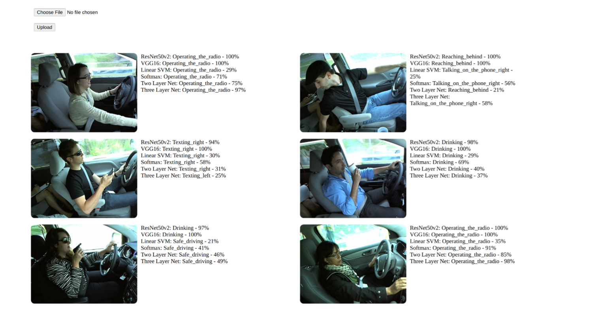
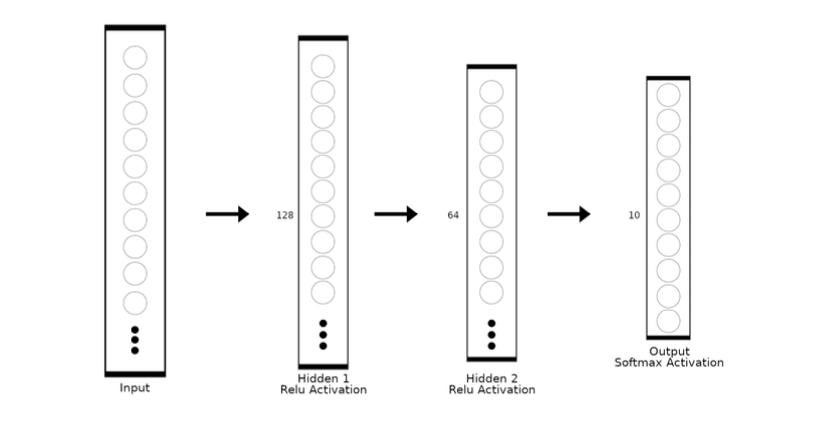
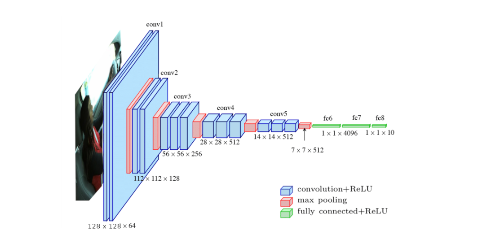
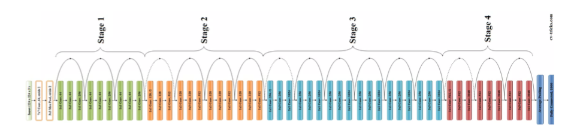

# Image Classification: Motorist Behavior

This project is designed to classify images into ten different categories based on driver behavior. The dataset is provided from State Farm https://www.kaggle.com/competitions/state-farm-distracted-driver-detection/data. The goal is to identify various activities that a motorist might be engaged in while driving. The ten categories are:

- c0: Normal Driving
- c1: Texting - Right
- c2: Talking on the Phone - Right
- c3: Texting - Left
- c4: Talking on the Phone - Left
- c5: Operating the Radio
- c6: Drinking
- c7: Reaching Behind
- c8: Hair and Makeup
- c9: Talking to Passenger

The classification model is trained to recognize these activities from input images.

## Model Architectures

The project use a diverse range of model architectures to perform image classification, Starting with the simplicity of the k-Nearest Neighbors (k-NN) algorithm, which relies on the proximity of data points in feature space, and a linear Support Vector Machine (SVM) provide basic yet effective approaches to classification.

Moving towards more complexity, the project incorporates a three-layer neural network, allowing for the extraction of hierarchical features from the input data. The implementation also includes renowned pre-trained models like VGG-16 with Transfer Learning, leveraging the knowledge gained from large datasets. Additionally, the ResNet50v2 architecture, known for its deep residual learning, is employed to capture intricate patterns and features within the images.

- ### **k Nearest Neighbors (k-NN)**

  The algorithm computes distances, using metrics like Euclidean distance, to measure the similarity between images. The class label assigned to a new image is determined by the majority class of its k-nearest neighbors.
   
  
  

- ### **Linear SVM**
  Support Vector Machine (SVM) create optimal decision boundaries in high-dimensional feature spaces. Linear SVM use a single straight line to seperate the data points to classified it into 2 classes. Each image in our dataset is represented as a set of features, and the SVM algorithm aims to find a hyperplane that maximally separates different classes while minimizing classification errors. This hyperplane is determined by support vectors, which are representative data points lying closest to the decision boundary.  
  
  
- ### **Three Layer Net**
  This neural network architecture comprises an input layer, 2 hidden layer, and an output layer. Each image in our dataset is flattened into a feature vector and serves as the input to the neural network. The hidden layer, with its set of neurons, processes these features through weighted connections and applies relu activation functions, allowing the network to learn complex hierarchical representations. L2 regularization and dropout is used to prevent overfitting and adam optimizer to update / learn W (weights)
   
  
- ### **VGG-16 with Transfer Learning**
  VGG-16 is a deep convolutional neural network known for its depth and excellent feature extraction capabilities. By employing transfer learning, we take advantage of the pre-trained VGG-16 model on a large dataset like ImageNet. The pre-trained weights and learned features are transferred to our specific image classification task, significantly reducing the need for extensive training on our limited dataset. Fine-tuning is performed on the last few layers to adapt the model to our particular classification requirements.
   
  
- ### **ResNet50v2**
  ResNet-50v2, a variant of the Residual Network architecture, is renowned for its deep structure and ability to mitigate the vanishing gradient problem. With transfer learning, we capitalize on the pre-trained ResNet-50v2 model, initially trained on extensive datasets like ImageNet. This enables our project to leverage the learned features and weights from the pre-training, making the model adept at recognizing complex patterns and hierarchical representations. Through fine-tuning, we adapt the pre-trained model to our specific image classification task.
   
  
